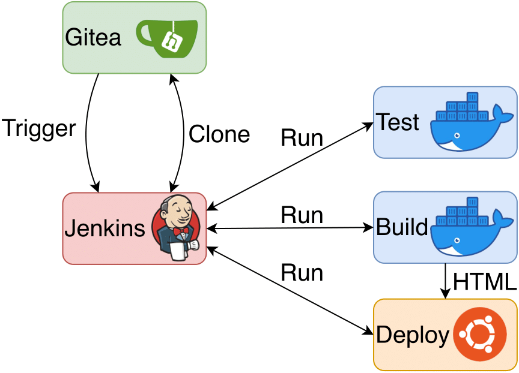

Each push to the `ESBO-ETC Repository <https://egit.irs.uni-stuttgart.de/esbo_ds/ESBO-ETC>`_ triggers a Jenkins CI/CD-pipeline on the ESBO-DS VM.
This pipeline first executes all unittests to ensure the prober functioning of the code. Afterwards this documentation is being built and deployed to the webroot of ESBO-DS' webserver.
All these build steps are defined within a Jenkins-file in the root of the repository. The complete CI/CD set up is shown in the following figure.

   CI/CD configuration.

Jenkins Configuration
---------------------

In `Jenkins <http://esbo-ds.irs.uni-stuttgart.de:8080>`_ the pipeline `ESBO-ETC <http://esbo-ds.irs.uni-stuttgart.de:8080/job/ESBO-ETC/>`_ is defined and configured to read all sources including the Jenkins-file from the ESBO-ETC repository in Gitea.
Additionally, a webhook is set up and included in `Gitea <https://egit.irs.uni-stuttgart.de/esbo_ds/ESBO-ETC/settings/hooks>`_ to trigger the pipeline after each push to the repository.
After the pipeline has been triggered, Jenkins clones the repository and executes the contained Jenkins-file.

Pipeline
--------

The pipeline is divided into three steps:

1. **Test:** A docker image containing a complete python installation and a virtual environment is built using the Dockerfile in the root of the repo.
Afterwards all required python modules (see ``requirements.txt``) are being installed in the container and the unittests defined in ``tests`` executed.
If all tests pass, the pipeline continues with stage 2.

2. **Build Docs:** The documentation is being build using the previous docker image.
After all required python modules have been installed, the build process using sphinx is started.
The results of the build process (all website files) are archived (stashed) for the next stage of the pipeline as shown in the image above.

3. **Deploy Docs:** The last stage of the pipeline is run locally on the ESBO-DS VM.
The build results from the previous stage are unarchived and copied to the webroot of the webserver.

