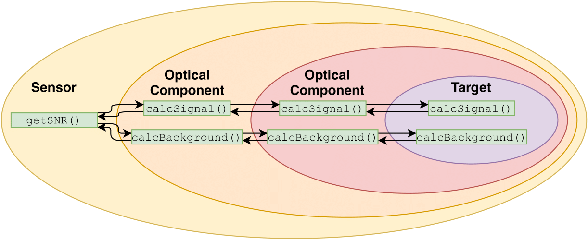
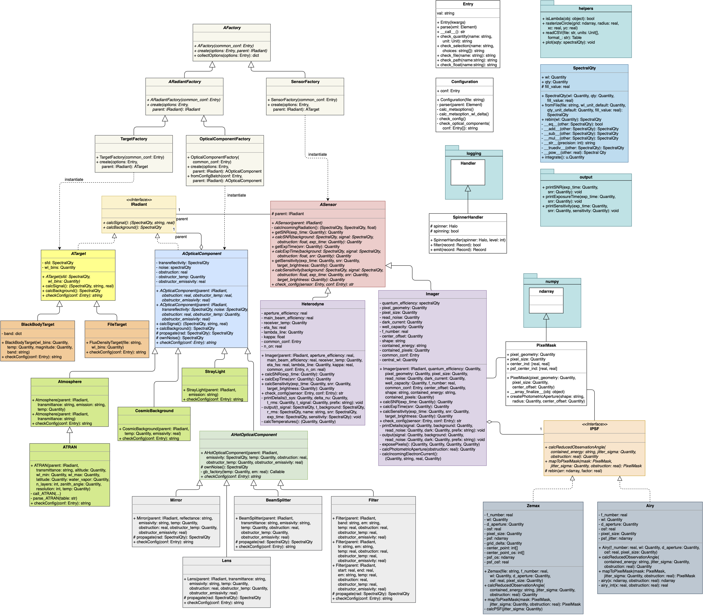
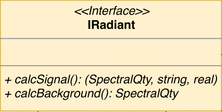
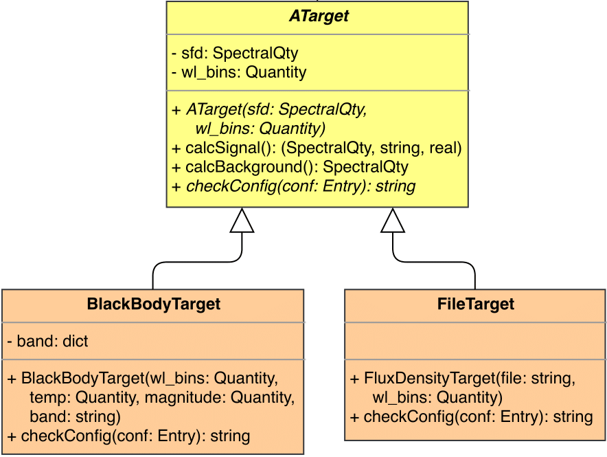
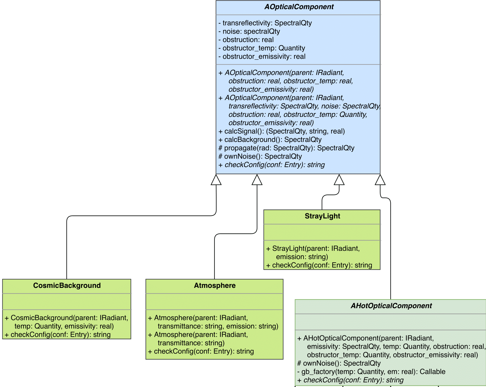
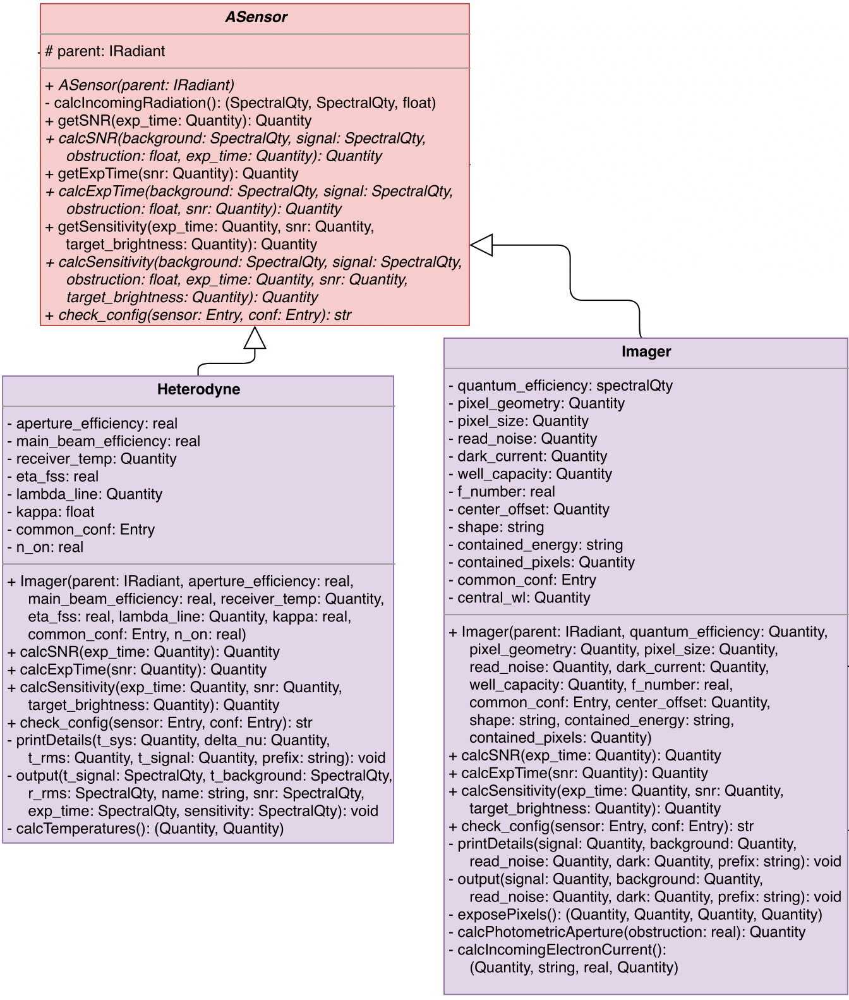
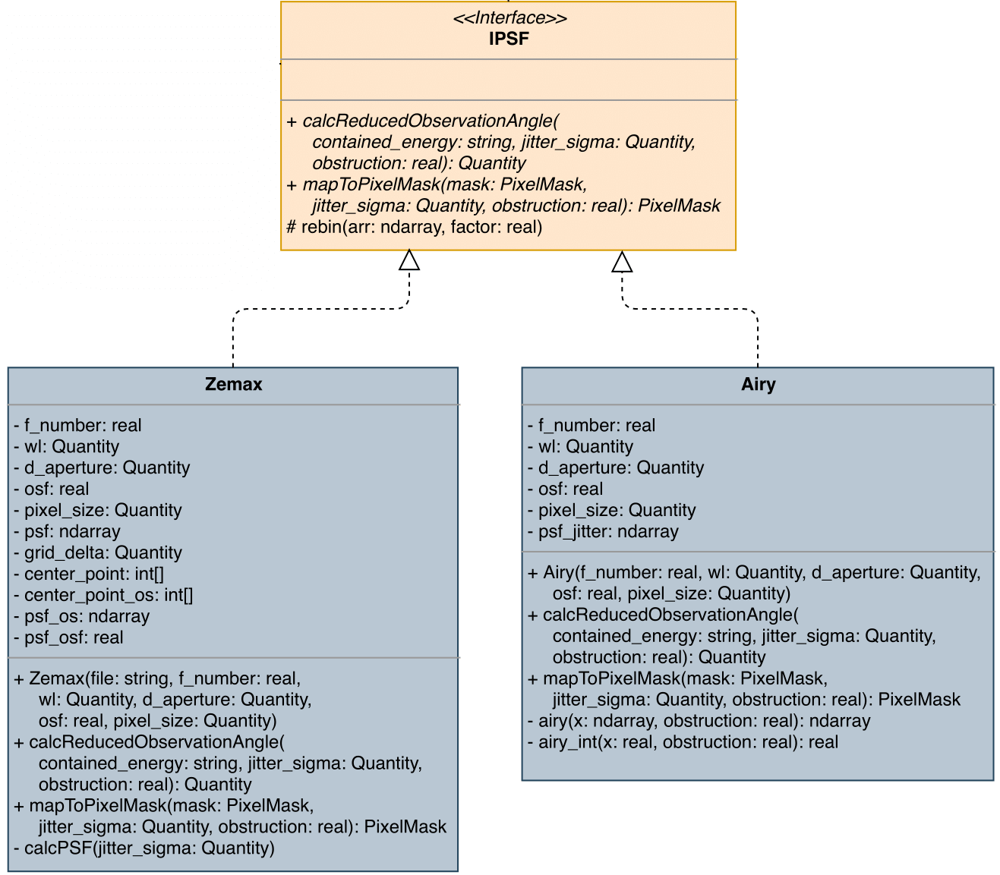
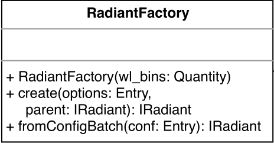
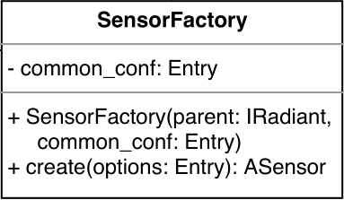

For modelling the radiation transportation, the `decorator pattern <https://en.wikipedia.org/wiki/Decorator_pattern>`_ was used as shown in the figure below.

   The decorator pattern used for the radiation transportation.

The radiation transportation pipeline consists always of a single target emitting the signal radiation.
This target may be encapsulated by multiple optical components which manipulate the radiation by either adding their own background radiation or by decreasing the transmitted radiation.
The outermost part of the radiation transportation pipeline is formed by some kind of sensor component, detecting the radiation.
The quality of the detected signal can then be determined by calculating the signal to noise ration (SNR).

   Class diagram of the software architecture.

Radiant Interface
-----------------

   Class diagram of the interface IRadiant.

In order to implement the aforementioned radiation transportation pipeline, a sophisticated software architecture has been designed.
As shown in the class diagram, the class ``IRadiant`` forms the backbone of the structure.
This interface class defines the two methods ``calcSignal()`` and ``calcBackground()`` and therefore the basic layout of all decorated classes.
All targets and optical components implement this interface in oder to allow the cascading calculation of the signal and background fluxes.
For both targets and optical components exists an abstract superclass which implements the required interface. This allows the actual
classes to focus on the initialization and calculation of their own properties, ignoring the implementation of the interface.

Target
^^^^^^

   Class diagram of the target classes.

The abstract class ``ATarget`` implements the interface provided by ``IRadiant`` and provides the abstract method ``checkConfig()`` which is used to check the relevant parts of the configuration file for this component.
All available target types must inherit from ``ATarget`` and therefore must implement the method ``checkConfig()``.
As the superclass ``ATarget`` implements the interface provided by ``IRadiant``, the compatibility to the radiation transportation pipeline is ensured.
All subclasses therefore only set up a ``SpectralQty``-object containing the emitted radiation and call the constructor of ``ATarget``.

Optical Component
^^^^^^^^^^^^^^^^^

   Class diagram of the optical components.

The abstract class ``AOpticalComponent`` implements the interface provided by ``IRadiant`` and thereby the two methods ``calcSignal()`` and ``calcBackground()``.
This includes the treatment of central obstruction of the components as well as transmittance / reflectance coefficients.
Additionally, ``AOpticalComponent`` provides the two methods ``propagate()`` for handling the propagation of incoming radiation through the optical component and ``ownNoise()`` for calculating the background radiation contribution of this component.
The two function may be overwritten by the subclasses, if a custom implementation is necessary.
Otherwise, the parameters ``transreflectivity`` and ``noise`` of the constructor method will be used for the calculations.
In order to check the relevant parts of the configuration file for this component, the class provides the abstract method ``checkConfig()`` which has to be implement by all subclasses.

According to the restrictions above, subclasses of ``AOpticalComponent`` can be implemented in two possible ways: either by providing the parameters ``transreflectivity`` and ``noise`` to the constructor of the superclass or by implementing the two methods ``propagate()`` and ``ownNoise()``.

Hot Optical Component
"""""""""""""""""""""

.. figure:: images/HotOpticalComponent.png
   :alt: Hot optical component classes

   Class diagram of the hot optical components.

The abstract class ``AHotOpticalComponent`` extends the abstract superclass ``AOpticalComponent`` by implementing the method ``ownNoise()`` assuming grey body radiation in order to model optical components with a thermal background contribution.
This has the consequence, that every subclass of ``AHotOpticalComponent`` must implement the method ``propagate()``, which handles to propagation of the signal and backgroudn radiation through the component.
Like ``AOpticalComponent``, the class ``AHotOpticalComponent`` provides the abstract method ``checkConfig()`` for checking the configuration file.

Sensor
------

   Class diagram of the sensor components.

The abstract class ``ASensor`` is the superclass that must be subclassed by every sensor class.
It provides the three abstract methods ``calcSNR()``, ``calcExpTime()`` and ``calSensitivity()`` which must be implemented by the subclasses.
These three abstract methods act as interface for the processing and evaluation of the incoming radiation in the detector.
``getSNR()``, ``getExpTime()`` and ``getSensitivity()`` are called by the main application to trigger the evaluation of the radiation transportation pipeline and the subsequent calculation of the desired quantity.
Additionally, ``ASensor`` defines the abstract method ``checkConfig()`` to allow the check of the sensor-configuration.

PSF
---

   Class diagram of the PSF classes.

For modelling the diffraction behaviour of the telescope, the interface ``IPSF`` defines the necessary methods.
Currently, two different implementations of PSFs are available: the class ``Airy`` allows to model the PSF as an airy disk, whereas the class ``Zemax`` allows to use a PSF calculated by the software Zemax.
Both classes allow the computation of the reduced observation angle for a given encircled energy and the mapping of the PSF onto an pixel grid.

Factories
---------

In order to instantiate the corresponding objects from the configuration file, the `factory method pattern <https://en.wikipedia.org/wiki/Factory_method_pattern>`_ was used.
The following two factory methods are responsible for transforming the parsed configuration into the cascaded radiation transportation pipeline.

Radiant Factory
^^^^^^^^^^^^^^^

   Class diagram of the radiant factory.

The class ``RadiantFactory`` is responsible for the instantiation of all targets and optical components.
Therefore the method ``create()`` analyzes the parsed configuration and assembles the necessary parameters for the following instantiation of the object.
The method ``fromConfigBatch`` allows to set up a batch of objects starting with a target and continuing with possibly multiple optical components.

Sensor Factory
^^^^^^^^^^^^^^

   Class diagram of the sensor factory.

The class ``SensorFactory`` allows to instantiate a sensor object from the parsed configuration.
In detail, the method ``create()`` is responsible for assembling all parameters and setting up the object.
